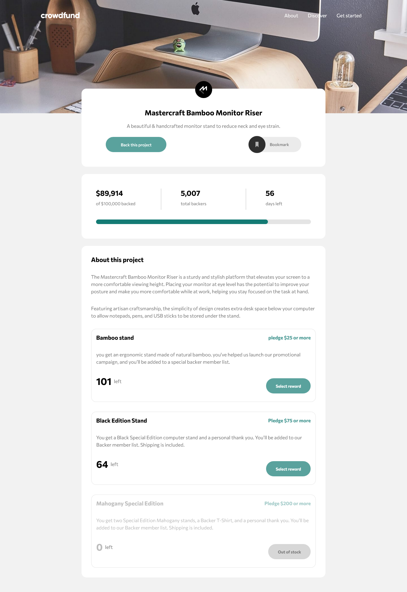
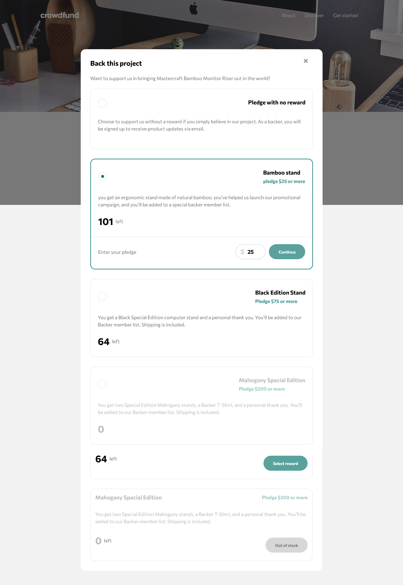
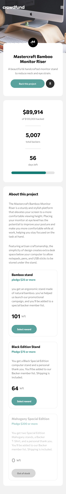

# Frontend Mentor - Crowdfunding product page solution

This is a solution to the [Crowdfunding product page challenge on Frontend Mentor](https://www.frontendmentor.io/challenges/crowdfunding-product-page-7uvcZe7ZR). Frontend Mentor challenges help you improve your coding skills by building realistic projects.

## Table of contents

- [Overview](#overview)
  - [The challenge](#the-challenge)
  - [Screenshot](#screenshot)
  - [Links](#links)
- [My process](#my-process)
  - [Built with](#built-with)
  - [What I learned](#what-i-learned)
  - [Continued development](#continued-development)
  - [Useful resources](#useful-resources)
- [Author](#author)
- [Acknowledgments](#acknowledgments)

## Overview

### The challenge

Users should be able to:

- View the optimal layout depending on their device's screen size
- See hover states for interactive elements
- Make a selection of which pledge to make
- Toggle whether or not the product is bookmarked

### Screenshot

### Links

- Live Site URL: [live](https://crowdfunding-landingpage-frontend.netlify.app/)

## Author

- Website - [in progress](https://www.your-site.com)
- Frontend Mentor - [@leandrNvs](https://www.frontendmentor.io/profile/leandrNvs)
- Linkedin - [contact me](https://www.linkedin.com/in/leandrnvs/)
